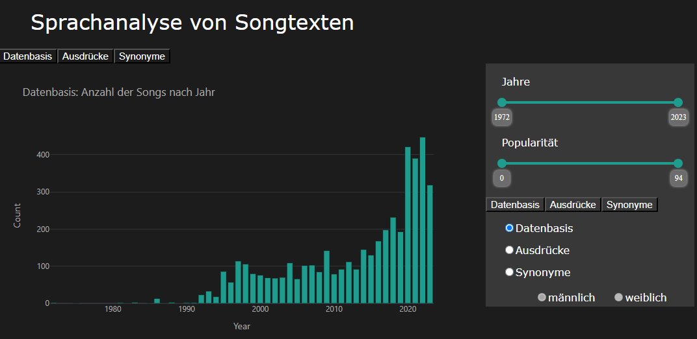

# Fachpraktikum-Songtexte
 
 - Im File Packages.py sind alle Packages enthalten, die für dieses Projekt geladenen werden müssen, um das gesamte Projekt auszuführen. 
Zum installieren der externen Pakete bitte
`python -m pip install -r ./environment/requirements.txt`
ausführen
 
 1. Spotify and LyricGenius API: (`getlyrics.py`)

Um diese Datei ausführen zu können muss ein Konto bei [Spotify](https://developer.spotify.com/documentation/web-api) sowie [LyricsGenius](https://lyricsgenius.readthedocs.io/en/master/setup.html) erstellt werden und die entsprechenden API-Keys gesetzt werden.
Mit dieser Datei werden die Spotifysongs oder -playlisten ausgesucht und die entsprechenden Songtexte, Artists, Erscheinungsdatum sowie -jahre und die Popularität (Eigenwert bei Spotify) herausgefiltert. 
Dann wird eine Datei all_songs_neu2.json erstellt, welche die zuvor genannten Daten enthält in einem Dictonary Spotify. Hier können auch mehrere Dictonaries für verschiedene Playlisten angelegt werden.
Es kann vorkommen, dass in der JSON Datein auch Songtexte enthalten sind, die nicht dem Original entsprechen. Dieser Fehler liegt bei LyricsGenius und kann in diesem Rahmen nicht behoben werden. Diese Texte sind als weißer Text erkennbar. Einzige Fehlerbehebung ist das manuelle entfernen dieser Dateien

2. Analyse der Songs: (`Analysis.py`)

Zur Unterstützung der Ausführung der Datei wurden drei CSV Dateien erstellt 
- ausdruecke.csv (Quelle: https://de.wikipedia.org/wiki/Kategorie:Schimpfwort_(Person))
- Mann_Frau.csv 
- gender_neu_Nomen.csv (Quelle: https://geschicktgendern.de/ , Stand 06/2023)

Nun wird auf die erstellte Datei aus 1. das Spacy Framework [de_core_news_lg-3.5.0-py3-none-any.whl](https://spacy.io/models/de/#de_core_news_lg) (Quelle: [Download](https://github.com/explosion/spacy-models/releases/download/de_core_news_lg-3.6.0/de_core_news_lg-3.6.0-py3-none-any.whl)) angewandt. Dieses dient zur Analyse, ob das Nomen maskulin, feminin oder neutral ist. Danach wird ein Listenvergleich durchgeführt, um zu prüfen, welches der Nomen in den CSV Dateien enthalten ist.
`python -m spacy download de_core_news_lg`

3. Darstellen der Ergebnisse: (`dashboard.py`)

Durch ausführen von `dashboard.py` wird mittels Dash ein Webserver erstellt, wo mit den Daten interagiert werden kann.

 ------------------------------------------------------------------------------------------------------------------------------------------------------------------------

1. Kontext des Projekts  

1.1 Thema des Projekts  

Das Projekt untersucht im Rahmen des Fachpraktikums Sprachtechnologie die Sprachentwicklung in Songtexten. Es geht der Forschungsfrage nach, welche sprachliche Entwicklung es in den Songtexten von deutschen Liedern ab 1990 gegeben hat. Der Fokus liegt dabei auf der gendergerechten Sprache. Es werden aber auch andere Phänomene im Zusammenhang mit den Geschlechtern in den deutschen Songtexten untersucht.  

Unter gendergerechter Sprache ist ein Sprachgebrauch zu verstehen, der die Gleichbehandlung und die Gleichstellung der Geschlechter in gesprochener und geschriebener Sprache zum Ziel hat. Dabei sollen geschlechtsbezogene Verzerrungseffekte (sogenannter gender bias) vermieden werden. Die gendergerechte Sprache versucht, Formulierungen zu vermeiden, welche zu falschen oder irreführenden geschlechtsbezogenen Darstellungen führen. Ein solcher Verzerrungseffekt entsteht in der deutschen Sprache insbesondere durch die Verwendung des generischen Maskulinums. Damit ist die Verwendung eines maskulinen Pronomens oder Nomens gemeint, welche sich auf eine unbestimmte Person oder einen unbestimmten oder verschiedengeschlechtlichen Personenkreis bezieht (z. B. im Satz: Die Studenten besuchen die Vorlesung.). Der Gebrauch des generischen Maskulinums kann auf folgende Arten vermieden werden:  

- Nennung der femininen als auch maskulinen Wortform (Paarform, z. B. Studentinnen und Studenten) 
- Einsatz alternativer Formen, wie z.B. substantivierte Partizipien (Studierende) oder kollektive sowie abstrakte Bezeichnungen (Fachleute, Kundschaft)  
- Verwendung von Trennzeichen wie z.B. Schrägstriche (Student/-innen)
- Verwendung eines Genderstern (Student*innen) oder dem Binnen-I (StudentInnen) 

Neben der gendergerechten Sprache untersucht das Projekt auch andere Phänomen in Bezug auf die Geschlechter. Dazu zählen beispielsweise Ausdrücke für Mann und Frau, welche sich in den Songtexten finden. Das vorliegende Projekt geht von einer binären Geschlechterordnung aus. Das heisst, es werden nur die beiden Geschlechter männlich und weiblich betrachtet. Eine non-binäre Sprache, welche weitere bis gar unendlich viele Geschlechter erfasst, ist erst noch am Entstehen. Gewissermaßen fehlen in der deutschen Sprache noch die Worte, um non-binäre Personen zu erfassen. 

1.2 Einordnung der Thematik in das Fachpraktikum Sprachentechnologie 

Das Projektthema Sprachentwicklung ist in zweifacher Hinsicht bedeutend für die Sprachtechnologie. Zum einen ist der Umstand, dass sich die Sprache entwickelt eine besondere Herausforderung für die Sprachtechnologie. Die Sprache unterliegt stetigen Veränderungen und besitzt somit eine Dynamik. Sie entwickelt sich ständig weiter, da neue Wörter, Ausdrücke und Sprachmuster entstehen. Die Sprachtechnologie muss flexibel sein, um auf die Entwicklungen zu reagieren und sich an diese Veränderungen anzupassen. Das kann aus technischer Sicht herausfordernd sein.  

Zum anderen kann die Sprachtechnologie (wie im vorliegenden Projekt) helfen, Entwicklungen in der Sprache zu analysieren und sichtbar zu machen. Sie kann beispielsweise in Bezug auf das Projektthema eine grosse Zahl an Songtexten auswerten und die Veränderungen in der Sprache im Laufe der Zeit identifizieren. Eine solche Analyse kann Informationen über den Gebrauch von Wörtern mit Bezug zu den Geschlechtern in verschiedenen historischen Perioden liefern. Durch die Analyse von Songtexten kann die Sprachtechnologie Trends in der öffentlichen Meinung und in der emotionalen Stimmung der Gesellschaft erkennen. Dies ermöglicht es, Veränderungen in der Einstellung und Meinungen der Menschen im Laufe der Zeit zu verfolgen.  

2. Hintergrund und Idee
   
2.1 Relevanz und Hintergrund des Projekts 

Songtexte können als Spiegel der Gesellschaft dienen. Das heisst, in den Liedern spiegeln sich oft soziale, kulturelle wie auch politische Aspekte der Gesellschaft wider. So nutzen viel Künstler und Interpreten die Musik, um soziale Missstände anzuprangern, Ungerechtigkeiten zu thematisieren oder auf wichtige gesellschaftliche Probleme aufmerksam zu machen. Dadurch können Songtexte Diskussionen anstoßen und die öffentliche Meinung beeinflussen. Songtexte können Einblicke in die kulturelle Identität bieten aber auch die emotionalen Zustände und Stimmungen einer Gesellschaft widerspiegeln. Sie können Ereignisse und Trends der Zeit reflektieren und dadurch Einblick in die Denkweise und das Lebensgefühl einer bestimmten Epoche bieten. Auch nutzen Künstler/-innen oft Songtexte, um politische Botschaften zu verbreiten und auf politische Themen aufmerksam zu machen. Das vorliegende Projekt zur Sprachentwicklung in Songtexten kann helfen, gesellschaftliche Phänomen rund um die Geschlechterdebatte zu verstehen. Es kann zum Beispiel Hassrede und geschlechterverachtende Sprache in Songtexten sichtbar machen.  

2.2 Idee und Ziele 

Die Idee des Projekts besteht darin, Songtexten in Bezug auf die Sprachentwicklung zu analysieren. Anhand von sprachlichen Veränderungen in den Songtexten sollen so gesellschaftlich relevante Phänomene mit Bezug zu den Geschlechtern, wie zum Beispiel die gendergerechte Sprache, sichtbar gemacht werden. Die Ergebnisse werden auf einem Dashboard visualisiert, wodurch gleichzeitig eine interaktive Exploration möglich wird.  
Mit dem Projekt werden folgende Ziele verfolgt:  

- Die Forschungsfrage, ob und inwiefern die gendergerechte Sprache ab 1990 in den Songtexten von deutschen Liedern Einzug gehalten hat, ist geklärt.
- Es liegt ein Dashboard vor, welches die Forschungsergebnisse interaktiv auswertet und sichtbar macht.  

3. Umsetzung und Design
   
3.1 Lösungsskizze: methodisches Vorgehen und experimentelles Design  

Das experimentelle Design des Projekts besteht darin, dass in einem ersten Schritt eine Quelle in Form einer Playlist erstellt wird, welche die Datenbasis für die Untersuchung bildet. Diese zufällig erstellte Playlist stammt aus Spotify und wird mit Hilfe der entsprechenden API automatisch extrahiert. Die Datenbasis besteht aus ca. 5200 deutschsprachigen Liedern. In einem zweiten Schritt wird daraus mit dem Tool LyricsGenius die Datenquelle generiert. Diese besteht aus ca. 53000 Entitäten. In dieser Datenbasis wird schließlich, in einem dritten Schritt, nach Nomen und Pronomen gesucht. Die eingesetzten Tools bilden dabei SpaCy. Anschliessend, in einem vierten Schritt, findet ein Abgleich mit aktuellen Listen statt. Diese Listen bestehen sowohl aus genderneutralen Begriff, wie auch aus Beschmipfungen. Im Abschliessenden, fünften Schritt, geschieht dann die Visualisierung der Ergebnisse in Form eines Dashboards.  
Das methodische Vorgehen zur Umsetzung der Forschungsfrage besteht somit, einfach gesprochen in einem Listenabgleich. Das heißt, die Datenquelle bestehend aus Songtexten wird mit einer Liste von Ausdrücken mit Bezug z.B. zu einem Geschlecht abgeglichen. Dazu wird zunächst in den Songtexten nach Nomen gesucht. Im Anschluss findet dann ein Vergleich mit einer Liste von Wörtern (z.B. aus Websiten, Wikipedia) statt.  

3.2 Vorgehen bei der Umsetzung im Detail 

Die Umsetzung des Projekts kann im Detail in fünf Phasen eingeteilt werden. Die erste Phase diente der Vorbereitung. Es wurde die Methode bestimmt, mit welcher die Forschungsfrage geklärt werden soll. Dazu fand eine Recherche nach vergleichbaren Forschungsarbeiten statt. Eine gute Grundlage bildete die Untersuchung von T. Diesner-Mayer zur computerlinguistischen Unterstützung des gendergerechten Schreibens (Hagen 2021) (https://ub-deposit.fernuni-hagen.de/servlets/MCRFileNodeServlet/mir_derivate_00002261/BA_Diesner_Mayer_2021.pdf).  

In der zweiten Phase wurde dann das experimentelle Design entwickelt. Dieses bildete dann die Basis für die Architektur und die Programmierung. Um die Analyse der Songtexte durchführen zu können, wurden zudem bekannte Verfahren des Natural Language Processing geprüft (z. B. Tokenisierung, PoS-Tagging, Lemmatisierung). Es stellte sich jedoch heraus, dass die Untersuchung der gendergerechten Sprache mit diesen Verfahren eine hohe Komplexität aufweist. Die Komplexität zur Erkennung von genderneutralen Begriffen besteht vor allem an der Darstellung in 1.1. Häufig sind genderneutrale Begriffe in Songtexten nicht mit Trennzeichen erkennbar, sondern werden substantiviert oder es werden alternative Wörter verwendet. Allgemeine und grammatikalische Reglungen hierzu festzulegen, ist in den meisten Fällen nicht umsetzbar. Da genderneutrale Sprache im englischen Sprachraum kaum bis keine Bedeutung findet, sind wenige Programme oder Funktionen bereits vorhanden in genannten Packages.  Aus diesen Gründen wurde entschieden, dass das experimentelle Design bzw. das methodische Vorgehen vor allem aus einem Listenabgleich bestehen soll.  

Die dritte Phase diente der Datensammlung und -aufbereitung. Es wurde die Datenquelle für die anschliessende Untersuchung der Songtexte generiert. Als Quelle diente der Streamingdienst Spotify. Aus existierenden Playlists wurden die Songtitel ausgesucht. Es wurden Songtitel deutscher Lieder von 1990 bis zur Gegenwart gesammelt. Aus den Songtitel wurden anschliessend automatisch die Songtexte, Künstler und Entstehungsjahre extrahiert. Dazu diente die Spotify API sowie die LyricsGenius API. Nach der Datensammlung wurde dann die Standardisierung der Daten vorgenommen.  

In der vierten Phase wurde schliesslich der Prototyp entwickelt. Für dessen Entwicklung, wie für das gesamte Projekt, diente die Programmiersprache Python. Für die Analyse wurde auf das SpaCy Framework zurückgegriffen. Da die Einbeziehung dieses Frameworks auch ein Training in der Zielsprache voraussetzt, wurde beim SpaCy-Projekt auf das bereitgestellte Modell de_dep_news_trf zurückgegriffen. Für das Frontend wurde ein Dash Framework verwendet, um ein webbasiertes, interaktives Dashboard zu implementieren. 

In der fünften Phase fand dann die Analyse der Daten statt. Hierzu konnte eine Datenbank genutzt werden, die einen Vergleich zwischen Vorkommen von Nomen im Allgemeinen sowie von Nomen im generischen Maskulinum und im nicht-generischen Maskulinum im Speziellen unterstützt. Für die Visualisierung der Ergebnisse wurde ein Dashboard mit der Applikation Ploty Dash programmiert. Dank der interaktiven Auswertung wird schnell ersichtlich, ob und inwiefern sich die deutsche Sprache in den Songtexten mit Bezug auf die Geschlechter seit 1990 entwickelt hat.  

 
3.3 Interessante Designentscheidungen 

Eine wichtige Entscheidung in Bezug auf das Design betraf die Eingrenzung der Thematik. War das Thema anfänglich noch eng gefasst und auf die gendergerechte Sprache begrenzt, erfolgte im Laufe der Arbeit eine Öffnung. Neben der Genderthematik sollte auch der Umgang mit den Geschlechtern in Songtexten im Allgemeinen im Zentrum der Betrachtung stehen. So wurden auch Synonyme für Männer und Frauen oder Ausdrücke in Bezug auf die Geschlechter miteinbezogen. Ein zentrales Element des Dashboards bildet die Interaktivität. Das Dashboard wurde so konzipiert, dass nach Jahre gefiltert werden kann. Das heisst, die Granularität der Auswertung bilden Jahresschritte. Die Entwicklung der Songtexte kann mittels Graphen visualisiert werden. Auch sind Vergleiche und deren Visualisierung mit Hilfe von Balkendiagrammen möglich.  

 
3.4 Ausblick 

Der enge Zeitplan des Fachpraktikums beschränkte die Verwirklichung aller Ideen. Viele interessante Aspekte konnten nicht umgesetzt werden. Letztlich ist dem Projektteam die Zeit ausgegangen. Im Rahmen eines Ausblicks sollen jedoch mögliche Aspekte für eine Vertiefung ausgelotet werden. So wäre eine Filterung nach Genre wünschenswert. Diesbezüglich gilt es zu beachten, dass die Spotify API die Calls nicht mehr zugelassen hat. Auch wäre eine Suche von Songs über die Spotify API nach Jahren wünschenswert, welche dann mit SpaCy im Rahmen einer Textsprache identifiziert werden kann. Dies würde zu einer größeren Datenbasis führen. Auch könnte beim Design des Dashboards noch einiges herausgeholten werden. So wäre ein Aufrufen der Auswertungen per RadioButton (statt über unschöne Links) wünschenswert. In Bezug auf die gendergerechte Sprache wäre es von Vorteil, wenn die Daten der Vergleichswortlisten direkt aus den Websiten herausgezogen und dann direkt ein Abgleich gemacht werden könnte. Da das Thema gendern und geschlechtergerechte Sprache noch nicht abgeschlossen ist, würde durch eine direkte Extraktion aus den Websiten die Aktualität der Listen garantiert. Hierbei ist es wichtig zu beachten, dass die genderneutrale Sprache sich stetig weiterentwickelt und es keine festen Regelungen zu der Verwendung dieser Sprache gibt, wie z.B. Duden für die deutsche Sprache. Es ist somit zwingend erforderlich Quellen zu finden, die den aktuellen Stand der genderneutralen Sprache widerspiegeln.  

Dieses Fachpraktikum bietet lediglich eine einfach Grundlage zur Analyse dieser komplexen Thematik. 
